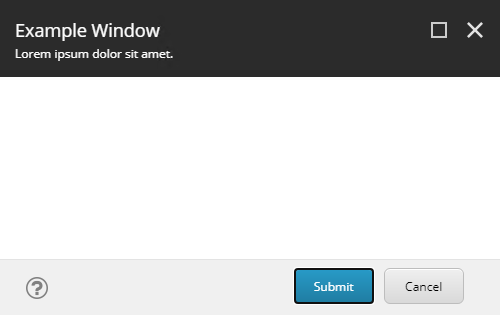
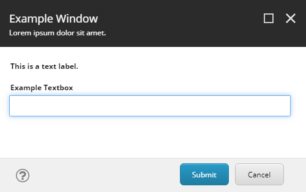
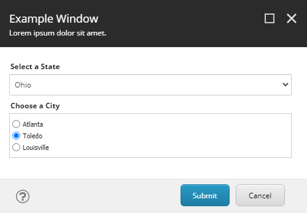
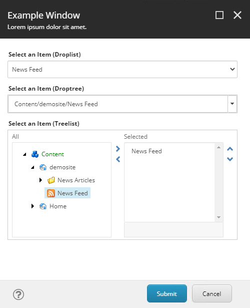

# Read-Variable

Please refer to the original SPE documentation for the most up-to-date information on this cmdlet:

* [Read-Variable](https://doc.sitecorepowershell.com/appendix/common/read-variable)
* [Read-Variable: Editor Types](https://doc.sitecorepowershell.com/interfaces/interactive-dialogs#variable-settings)

# Starter Kits

## 01 - Basics

Demonstrates the simplest configuration for a `Read-Variable` dialog (with no input fields).

## 02 - Text Input

Demonstrates _info_ and _textbox_ fields.

## 03 - Option Inputs

Demonstrates lists of options to populate _dropdown_ and _radio_ selection fields.

## 04 - Item Sources

Demonstrates how to use the _droplist_, _droptree_, and _treelist_ fields to select items from the Sitecore content tree.

## 05 - Input Validation

Demonstrates two types of input validation: mandatory fields and custom validator script block.

## 06 - Select Node, Run Report

Allows the user to select a node in the content tree to use a the start item of a report.