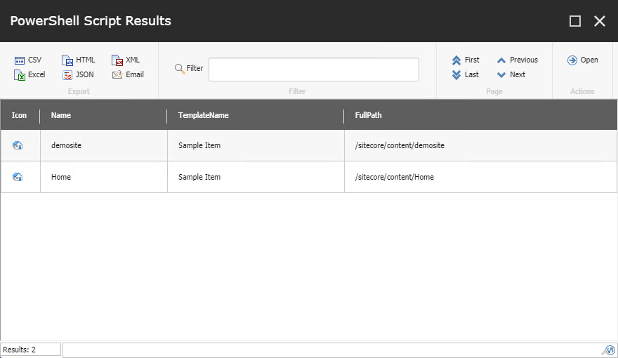
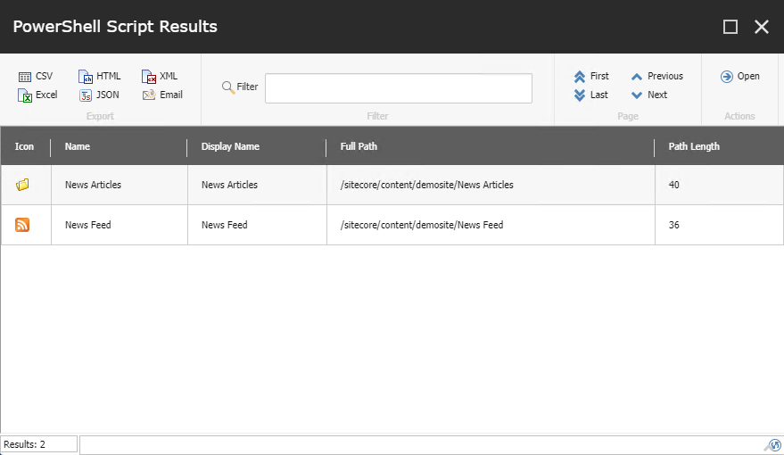
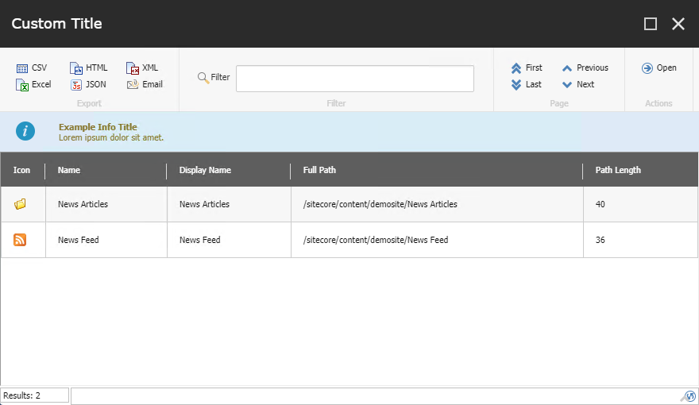

# Show-ListView

Please refer to the original SPE documentation for the most up-to-date information on this cmdlet:

* [Show-ListView](https://doc.sitecorepowershell.com/appendix/common/show-listview)

# Starter Kits

## 01 - Basics

Demonstrates the simplest configuration for a `Read-Variable` dialog (with no input fields).

## 02 - Custom Headers, Fields

Demonstrates the use of a properties object to define custom headers and assign fields to columns in a report.

## 03 - UI Parameters

Demonstrates several UI parameters available for the cmdlet.

## 04 - Custom Data Object

Demonstrates how to build up a .NET object to create data for a ListView.

## 04 - Custom PSObject

Demonstrates how to build up a .NET object to create data for a ListView.