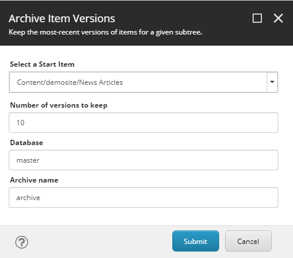

# Utility Scripts

This is a collection of scripts that I have written for various tasks in Sitecore 8 and up.

## 01 - Archive Item Versions

Archives all but a given number of historical item versions from the given node in the content tree.

## 02 - Change Item Base Templates

Allows a developer to change base templates of one or more items without losing stored content/values. For more information, see this post on Sitecore Spark: [Change Base Templates in Sitecore and Maintain Field Values](https://www.sitecorespark.com/blog/2020/9/change-base-templates-in-sitecore-and-maintain-field-values).